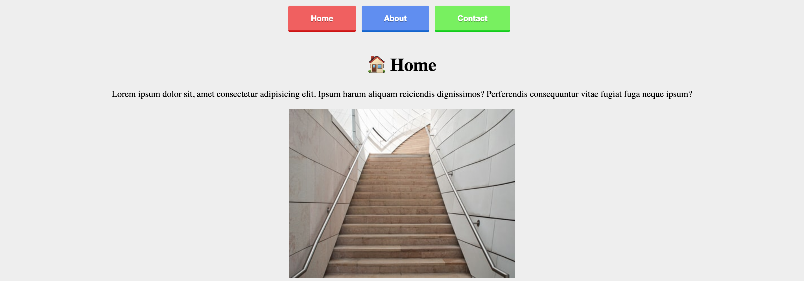

# Vanilla Router with location.hash [SPA]
## ✍🏻 Description
Adapté el código de creación de un router con vanilla js de [Alejandra Camacho](https://dev.to/alexcamachogz/creando-un-router-con-vanilla-javascript-27pl) usando el location.hash en vez del location.pathname como originalmente se hacía. Esto lo hice con el motivo de que se presentaba un error cuando se navegaba desde la URL del navegador.

## 🚀 Getting Started
Only you need download the project and open index.html with a local server. That's it.

## 🎨 Preview

## 👩🏻‍💻 Technologies
1. HTML
2. CSS
3. Javascript